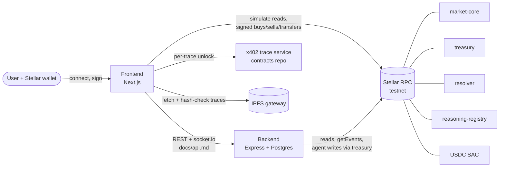

# OracleDesk Frontend

OracleDesk is an AI prediction-market terminal. Agents propose markets and trade them on Stellar, and every decision ships with a reasoning trace whose hash is recorded on-chain so anyone can check it. This repo is the Next.js web app. It reads the Soroban contracts directly for prices, positions and balances, signs trades with the user's own wallet, and uses the backend for market metadata, traces, login and subscriptions.

> **Testnet only, unaudited.** See [docs/STATUS.md](docs/STATUS.md) for what is verified.

## How the three repos fit

| Repo | Role |
|---|---|
| [OracleDesk-SmartContract](https://github.com/OracleDesk/OracleDesk-SmartContract) | Soroban contracts (`market-core`, `treasury`, `resolver`, `reasoning-registry`), generated TypeScript bindings, testnet deployment, the x402 trace service. **Source of truth.** Pinned here as the `contracts` submodule. |
| [OracleDesk-Backend](https://github.com/OracleDesk/OracleDesk-Backend) | API, event indexer and LLM pipeline. Wallet login, market and trace metadata, subscriptions, agent trades through the treasury. |
| **OracleDesk-Frontend** (this repo) | Web app. |



More detail in [docs/architecture.md](docs/architecture.md).

## Prerequisites

- Node.js 22 LTS (`.nvmrc`; Next.js 16 needs 20.9 or later). Built and tested here with Node 24.13.1 and npm 11.8.0; CI uses Node 22.
- npm 10 or later.
- A Stellar wallet browser extension, e.g. [Freighter](https://www.freighter.app/), set to **Testnet**.
- A running [backend](https://github.com/OracleDesk/OracleDesk-Backend) for anything beyond on-chain reads.

## Quick start

```bash
git clone --recurse-submodules https://github.com/OracleDesk/OracleDesk-Frontend.git
cd OracleDesk-Frontend
git submodule update --init      # if you cloned without --recurse-submodules
nvm use
npm ci
npm run sync:bindings            # no-op unless the submodule moved
cp .env.example .env.local       # point NEXT_PUBLIC_API_URL at your backend
npm run dev                      # http://localhost:3000
```

To trade on testnet you need XLM and test USDC; follow [docs/manual-test.md](docs/manual-test.md).

## Configuration

All variables are listed and explained in [.env.example](.env.example). Everything defaults to Stellar Testnet and the contract ids in the synced deployments file. Every `NEXT_PUBLIC_*` value is compiled into browser JavaScript, so never put a secret in one.

## Scripts

| Script | What it does |
|---|---|
| `npm run dev` | Dev server |
| `npm run build` / `npm start` | Production build / serve it |
| `npm run typecheck` | `tsc --noEmit` |
| `npm run lint` | ESLint |
| `npm test` | Vitest unit tests (`lib/**/*.test.ts`) |
| `npm run e2e:testnet` | Optional read-only check against a running backend and live testnet |
| `npm run sync:bindings` | Copy generated contract code from `contracts/` into `lib/stellar/generated/` |
| `npm run check:bindings` | Fail if `lib/stellar/generated/` is stale (CI runs this) |

## Project structure

```
app/                    Next.js App Router pages
components/             Layout and UI components
lib/api/                Backend REST client (envelope + JWT), typed per docs/api.md
lib/hooks/useStellar.ts React Query hooks for on-chain reads and writes
lib/stellar/            Config, units (7-decimal USDC as bigint), binding clients,
                        error messages, trace hash checks, wallet provider
lib/stellar/generated/  Copied from the contracts submodule. Do not edit.
contracts/              OracleDesk-SmartContract submodule (pinned)
scripts/                sync-bindings.mjs
e2e/                    Opt-in testnet checks
docs/                   API contract, architecture, porting notes, status, backlog
```

## Deployed testnet contracts

From `lib/stellar/generated/deployments.testnet.json` (contracts commit `eb5f3fd`):

| Contract | Id |
|---|---|
| market-core | `CC4MMHWZ6ZRYAOQRR42KIIWNEZNFM4CWQ5Y4NNWTWNRUYH2O7E3SRK2O` |
| treasury | `CBTFA3EPQ63PL5XXHOMU4LRDCAB2MHKOLEPDQI7E7TNK454YNBOMZLYB` |
| resolver | `CDDJU3PH6T3Z4O6EYLALXXB5XBFPYO2G5P5RBDEIZ7ZVN6V37OQSVYGR` |
| reasoning-registry | `CAFEED35XICK4OXIEXQDS6KTTBUA2LDNW3EXEUGTNMN54DY5ANETCH6M` |
| USDC (self-issued test asset, SAC) | `CA2WQQJ4OHQCLHQW6XN4BCLILGRV6V4YDYDT3GVIWXB53BTOO7EMREQH` |

## Contributing

See [CONTRIBUTING.md](CONTRIBUTING.md), including how to pick up a Drips Wave issue. Security reports: [SECURITY.md](SECURITY.md). License: [MIT](LICENSE).
